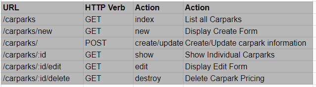

# Carpark Pricing SG - Where do I park?

In town and unsure where to park? 

Find out here: https://carpark-pricing-sg.herokuapp.com/

## Tech Stacks Used

Frontend: JS, CSS, HTML, EJS
Backend: ExpressJS, MongoDB

## Features of the app

### Restful Routes

7 Restful Routes

### Models Used

User, Carparks, Carpark_pricing

Explains all the technical details
Explain all the technical challenges - something that i learn 
this project
Show all Features of the App
Unsolved problems

### Interactive Map

Using Leaflet API - need to use code in 

Passing data from MongoDB -> Controller -> EjS -> script

Take note: Mongoose Object -> pass as object/props to EJS
EJS syntax might read it incorrectly
Had to convert to JSON string -> pass as a string to EJS, then JSON stringify back

### Conditional List

Filters by search

### Authentication

Standard authentication stuff. Learnt how to render content conditionally.
Next time can consider have different access levels for certain functions/buttons

### Future Improvements

1. Bus Stop timings - Make it live feed, like the otter in TraceTogether, so user don't need to click refresh

    

2. Search Page - I want to put a real time map of
   - User Location
   - Bus Stop locations
   - Interactive map - provides info when icons are clicked
  
    

3. Favourites page - explore local cache/storing/saving of favourite bus stops

